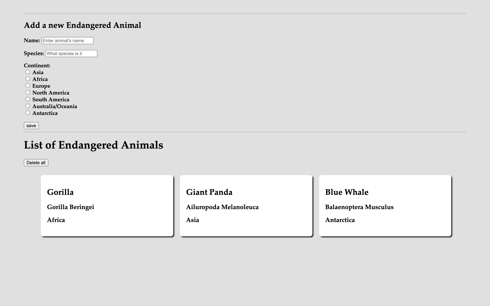

# List of Endangered Animals

JavaScript application that allows users to input items and see them displayed in a list.

### <a href="https://github.com/codeclan/g28_classnotes/blob/main/week_06/day_5/01_weekend_hw_dom_context/hw_dom/weekend_hw_dom.md">
Full homework brief</a>
#

## Loaded

## After 'delete all' button has been clicked

## Adding new animals to the list

